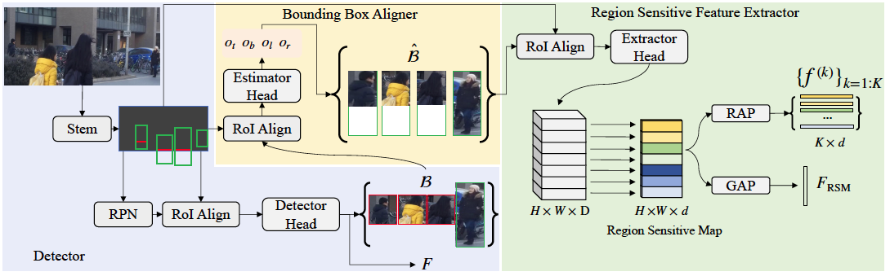

# APNet for Person Search

## Introduction

This is the code of [Robust Partial Matching for Person Search](https://arxiv.org/) accepted in CVPR2020. The Align-to-Part Network(APNet) is proposed to alleviate the misalignment problem occurred in pedestrian detector, facilitating the downstream re-identification task. The code is based on [maskrcnn-benchmark](https://github.com/facebookresearch/maskrcnn-benchmark). 

<div align=center>



</div>


## Quick start

### Installation

1. Please follow the offical installation [INSTALL.md](https://github.com/facebookresearch/maskrcnn-benchmark/blob/master/INSTALL.md). This code does not support the mixed precision training, so feel free to skip the installation of `apex`.

**NOTE:** If you meet some problems during the installation, you may find a solution in [issues of official maskrcnn-benchmark](https://github.com/facebookresearch/maskrcnn-benchmark/issues). 

2. Install `APNet`

````bash
git clone https://github.com/zhongyingji/APNet.git
cd APNet
rm -rf build/
python setup.py build develop
````

### Dataset Preparation

Make sure you have downloaded the dataset of person search like PRW-v16.04.20.

1. Since the training of APNet relies on the keypoint annotation, we provide the keypoint estimation file by [AlphaPose](https://github.com/MVIG-SJTU/AlphaPose) in `keypoint_pred/`. Copy all the files into the root dir of dataset, like `/path_to_prw_dataset/PRW-v16.04.20/`:

````bash
cp keypoint_pred/* /path_to_prw_dataset/PRW-v16.04.20/
````

2. Symlink the path to the dataset to `datasets/` as follows:

```bash
ln -s /path_to_prw_dataset/PRW-v16.04.20/ maskrcnn_benchmark/datasets/PRW-v16.04.20
```

### Training

APNet composes of three modules, [OIM](https://arxiv.org/pdf/1604.01850), RSFE and BBA. To train the entire network, you can simply run: 

```bash
./train.sh
```

which contains the training scripts of the three modules. 

**NOTE:** Both RSFE and BBA are required to be intialised with the trained OIM. For more details, please check `train.sh`. 

You can alter the scripts in `train.sh` in the following aspects:

1. We train OIM on 2 GPUS with batchsize 4. If you encounter out-of-memory (OOM) error, reduce the batchsize by setting `SOLVER.IMS_PER_BATCH` to a smaller number. 

2. If you want to use 1 GPU, replace the command of OIM with single GPU training script:

```bash
python tools/train_net.py --config-file "configs/reid/prw_R_50_C4.yaml" SOLVER.IMS_PER_BATCH 2 TEST.IMS_PER_BATCH 8 OUTPUT_DIR "models/prw_oim"
```

### Test

After each of the module has been trained, you can run exactly the same training script of that module to test the performance.


## Citation

If you find this work or code is helpful in your research, please consider citing: